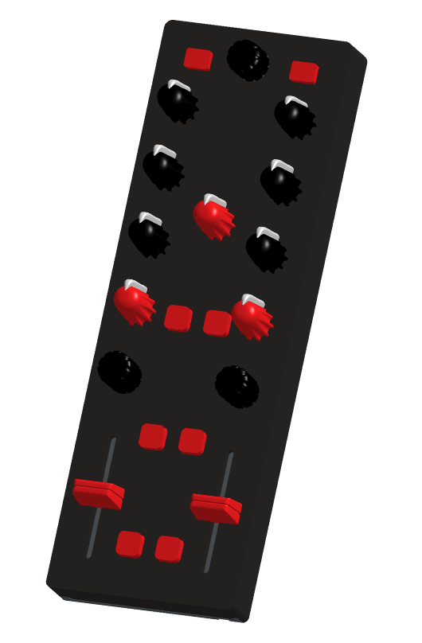

# 🎛️ DIY MIDI DJ Console

  

## 🎚️ What is this?

A custom-built **MIDI DJ console** designed and built from scratch. The console provides **MIDI control only** and does not include a built-in sound card.

## 🎧 2 → 4 Deck Expansion
It is designed primarily as an **extension controller**, making it ideal for expanding a standard **2-deck DJ setup into a 4-deck setup** without replacing the existing controller.

## 🔴⚫ The Console

The console features:

* 🎚️ Rotary controls for EQ, filter, gain, and other parameters
* 🎚️ Faders
* 🔘 Buttons
* 🎛️ Rotary controls

The layout is focused on providing additional hands-on controls for DJs who want to expand their setup while keeping their existing 2-deck controller.

Because the console is MIDI-only, it can be mapped to DJ software to suit the user's preferred workflow and configuration.

## 🛠️ Components Needed

### Potentiometers & Controls

| Component | Quantity | Description | Link |
|-----------|----------|-------------|------|
| **RV09 Potentiometers** | 9 | Rotary potentiometers for EQ, gain, filter, and other parameters | [AliExpress](https://www.aliexpress.com/item/1005006950939111.html?spm=a2g0o.order_list.order_list_main.5.75bc1802wQvTmo) |
| **60mm Sliding Potentiometers** | 2 | Linear faders for volume or channel control | [AliExpress](https://www.aliexpress.com/item/1005009375810589.html?spm=a2g0o.order_list.order_list_main.97.75bc1802wQvTmo) |
| **Rotary Encoder Switch EC11** | 1 | Rotary encoder with push-button for navigation or parameter selection | [AliExpress](https://www.aliexpress.com/item/1005006076665259.html?spm=a2g0o.order_list.order_list_main.62.75bc1802wQvTmo) |
| **Rotary Encoders** | 2 | Standard rotary encoders (without push-button) for additional controls | |

### Microcontroller & Signal Processing

| Component | Quantity | Description | Link |
|-----------|----------|-------------|------|
| **Raspberry Pi Pico RP2040** | 1 | Microcontroller board that handles MIDI communication and input processing | |
| **Multiplexer CD74HC4067** | 1 | 16-channel analog multiplexer for expanding the number of analog inputs on the Pico | [AliExpress](https://www.aliexpress.com/item/1005009887874792.html?spm=a2g0o.order_list.order_list_main.72.75bc1802wQvTmo) |
